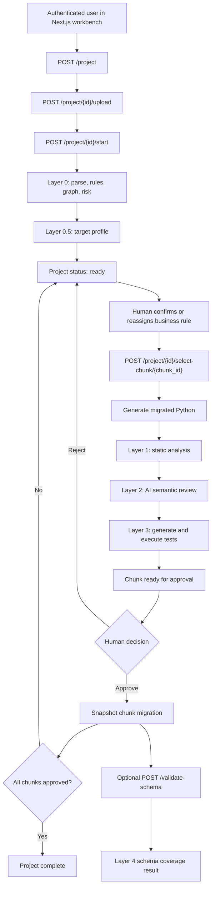
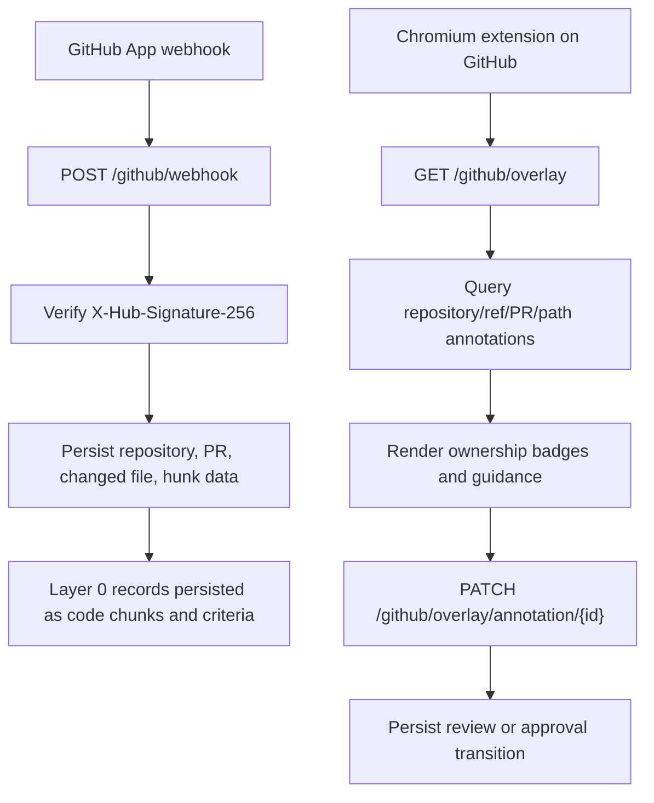

# LegacyLift Pipeline Documentation

## High-Level Overview

LegacyLift is an AI-assisted migration workbench for legacy COBOL, Java, VB6, and SQL-backed systems. The pipeline ingests uploaded source files, parses them into migration chunks, extracts business rules, maps dependencies, scores migration risk, and guides a human reviewer through rule confirmation, chunk migration, static validation, AI review, test generation, approval, and schema coverage checks.

The primary objective is controlled modernization rather than blind code translation. The system keeps business-rule ownership, approval state, generated code, review output, test results, and schema validation visible to engineers and system administrators so migration work can be audited, resumed, and troubleshot.

The technical value is concentrated in three areas: repeatable decomposition of legacy code, explicit human approval gates before migrated code is accepted, and operational surfaces for both the web workbench and GitHub overlay. The pipeline is intentionally staged; `/project/{id}/start` performs analysis and target profiling, while actual chunk migration begins only after a business rule is confirmed and the chunk is selected.

## Architecture & Flow

LegacyLift consists of four runtime surfaces:

| Surface | Location | Runtime | Responsibility |
|---|---|---|---|
| FastAPI server | `legacylift/server` | Python 3.12, Uvicorn | Pipeline orchestration, persistence, auth, LLM proxying, GitHub ingestion, overlay API |
| Next.js workbench | `legacylift/client` | Node.js 20+, Next.js 14 | Project creation, upload, review UI, WebSocket event rendering, chunk approval |
| Chromium extension | `legacylift/extension` | Manifest V3 JavaScript | Renders ownership and approval annotations inside GitHub PR and blob views |
| Database/storage | JSON, SQLite, or SQLAlchemy DB | File-backed SQLite by default | Project state, quotas, GitHub overlay state, ownership review audit data |

### Main Workbench Flow



### GitHub Overlay Flow



### State Model

The workbench project state machine is defined in `core/pipeline.py`:

| State | Meaning | Valid Next States |
|---|---|---|
| `created` | Project exists but may not have uploaded files | `uploading`, `analysing` |
| `uploading` | Files have been uploaded | `analysing` |
| `analysing` | Layer 0 and Layer 0.5 are running | `ready`, `failed` |
| `ready` | Analysis is complete; user can select a confirmed chunk | `migrating`, `validating` |
| `migrating` | A selected chunk is being generated, reviewed, and tested | `ready`, `validating`, `failed` |
| `validating` | Final validation or completion transition | `complete`, `failed` |
| `complete` | All chunks are approved | None |
| `failed` | Pipeline failed with an unrecoverable analysis error | None |

## Prerequisites & Dependencies

### System Requirements

| Requirement | Version / Notes |
|---|---|
| Python | 3.12 |
| Node.js | 20+ |
| Browser | Chromium or Chrome for the extension |
| Database | SQLite for local development; PostgreSQL is supported for SQLAlchemy overlay persistence through `DATABASE_URL` |
| Network access | Required for Clerk JWKS lookup, Venice API calls, GitHub App webhooks/API calls, and deployment builds |
| OS tools | Docker optional for server container deployment |

### Server Python Dependencies

Declared in `legacylift/server/requirements.txt`.

| Category | Packages |
|---|---|
| API runtime | `fastapi`, `uvicorn[standard]`, `websockets`, `python-multipart` |
| LLM client | `openai`, `tenacity` |
| Async I/O | `aiohttp`, `aiofiles`, `aiosqlite`, `asyncpg` |
| Persistence | `sqlalchemy`, `greenlet`, `alembic` |
| Data validation | `pydantic`, `pydantic-settings` |
| Auth | `PyJWT`, `cryptography` |
| Parsing | `tree-sitter`, `sqlparse` |
| Testing | `pytest`, `pytest-asyncio`, `pytest-mock`, `httpx` |
| Utilities | `python-dotenv`, `rich`, `python-dateutil` |

### Client Dependencies

Declared in `legacylift/client/package.json`.

| Category | Packages |
|---|---|
| Framework | `next`, `react`, `react-dom`, `typescript` |
| Auth | `@clerk/nextjs` |
| UI | Radix UI packages, `lucide-react`, `framer-motion`, `tailwindcss`, `reactflow` |
| Utilities | `jszip`, `react-diff-viewer-continued`, `clsx`, `tailwind-merge` |

### External Services

| Service | Required For | Notes |
|---|---|---|
| Clerk | Workbench and WebSocket auth | Server validates JWTs using `CLERK_JWKS_URL`; client uses Clerk publishable and secret keys |
| Venice AI | LLM-based rule extraction, migration generation, AI review, tests | Accessed through the OpenAI SDK using `VENICE_BASE_URL` |
| GitHub App | Overlay ingestion and PR synchronization | Webhook signature verification requires `GITHUB_WEBHOOK_SECRET` |
| Render, Vercel, Azure, Docker | Deployment options | Render config is present in `render.yaml`; Dockerfile exists for server |

## Component Breakdown

### Server Entry Points

| Component | Inputs | Outputs | Responsibility |
|---|---|---|---|
| `api/main.py` | HTTP requests, WebSocket connections, env vars | JSON responses, WebSocket events | FastAPI app, route definitions, CORS, lifespan startup, project orchestration |
| `api/auth.py` | Clerk bearer token or WebSocket query token | Clerk `sub` user ID | JWT verification through Clerk JWKS |
| `api/websocket_manager.py` | Project-scoped event payloads | WebSocket broadcasts and replay | Real-time pipeline event fanout |
| `api/github_overlay.py` | Overlay query/mutation HTTP requests | Annotation responses and workflow updates | Auth, repo authorization, rate limiting, overlay API routes |

### Storage and Database

| Component | Inputs | Outputs | Responsibility |
|---|---|---|---|
| `core/storage.py` | `Project` and `UserLimit` objects | JSON file or SQLite records | Workbench project persistence and quotas |
| `db/session.py` | `DATABASE_URL` | Async SQLAlchemy engine/session | Overlay database setup and health checks |
| `db/models.py` | SQLAlchemy metadata | Tables for repositories, commits, PRs, chunks, criteria, ownership, reviews, guidance, annotations | Persistent GitHub overlay schema |
| `db/repositories.py` | Parsed project/GitHub data | Upserted database records | Repository functions for ingestion, layer persistence, review audit data |

### Pipeline Core

| Component | Inputs | Outputs | Responsibility |
|---|---|---|---|
| `core/pipeline.py` | Uploaded project files and selected chunk IDs | Project status updates, generated migrations, WebSocket events | Main pipeline orchestration and state transitions |
| `core/layer0/__init__.py` | Uploaded COBOL, Java, VB6, SQL files | Parsed files, business rules, dependency graph, chunks, risk metadata | Code archaeology and first-pass ownership/risk extraction |
| `utils/code_parser.py` | File name and source text | `ParsedFile`, `CodeChunk`, dependency hints | Language-aware parser with regex and tree-sitter paths |
| `core/layer0_5/doc_fetcher.py` | Target language | Version and recommended library metadata | Target profile documentation lookup or demo fallback |
| `core/layer0_5/deprecation_mapper.py` | Source and target language | Deprecated pattern guidance | Migration compatibility mapping |
| `core/layer0_5/gotcha_registry.py` | Source and target language | Known migration pitfalls | Target-profile gotcha registry |
| `core/migration/generator.py` | Selected chunk, business rule, related chunks, file context, project manifest | Python migration code, explanation, confidence | LLM-backed code generation with demo fallback |
| `core/layer1/static_analyser.py` | Migrated Python and original source | Static issues, warnings, pass/fail | Deterministic syntax, annotation, float, branch, and antipattern checks |
| `core/layer2/ai_reviewer.py` | Original source, migrated code, business rule, static result | Semantic review findings | Adversarial LLM review of behavior differences |
| `core/layer3/test_generator.py` | Original source, migrated code, AI review output | Generated tests and execution results | LLM test generation plus isolated subprocess execution |
| `core/layer4/schema_validator.py` | Approved migrated chunks and uploaded SQL schema | Table/column coverage report | Textual schema completeness validation |

### LLM and Prompt Utilities

| Component | Inputs | Outputs | Responsibility |
|---|---|---|---|
| `utils/llm_client.py` | Prompts, model config, retry config | Completion text or stream chunks | Central Venice API wrapper using the OpenAI SDK |
| `utils/migration_prompts.py` | Chunk, rule, profile, file context | Prompt strings and parsed JSON helpers | On-demand `/llm/*` prompt construction |

All Python LLM-facing work requires advanced familiarity with async error handling, prompt contracts, JSON parsing, and retry behavior.

### Ownership and Review

| Component | Inputs | Outputs | Responsibility |
|---|---|---|---|
| `ownership/classifier.py` | Business rule text, ownership groups, optional LLM | Ownership classification | Rule-to-owner classification with deterministic scoring and optional LLM assist |
| `ownership/review_workflow.py` | Current review state and requested transition | Normalized workflow transition | Confirm, reassign, flag, request approval, approve, and waive transitions |
| `ownership/guidance.py` | Ownership classification and change text | Approval checklist, suggested tests, stakeholder messaging | Review guidance for overlay/workbench surfaces |

### GitHub Integration

| Component | Inputs | Outputs | Responsibility |
|---|---|---|---|
| `integrations/github_app.py` | GitHub webhook body, signature, app settings | Signature verdict, mock token helper | GitHub App settings and webhook verification |
| `integrations/github_client.py` | Installation token and GitHub API paths | Repository contents, PR files | GitHub REST client abstraction and mock client |
| `integrations/github_ingestion.py` | Webhook payloads | Repository, commit, PR, hunk, and chunk records | Installation, push, and pull request ingestion |
| `integrations/github_patches.py` | GitHub patch text | Parsed hunk ranges | PR patch parsing |
| `integrations/github_overlay.py` | Repo/ref/path or PR/path query | Overlay annotation payloads | Annotation lookup and mutation support |

### Client Workbench

| Component | Inputs | Outputs | Responsibility |
|---|---|---|---|
| `client/lib/api.ts` | Client actions and Clerk session token | Authenticated REST calls | Backend API wrapper and error normalization |
| `client/hooks/useWebSocket.ts` | Project ID and Clerk token | Event subscription API | WebSocket connection management |
| `client/hooks/usePipeline.ts` | WebSocket events and project ID | Normalized pipeline UI state | Pipeline state reducer for workbench components |
| `client/lib/migration.ts` | Chunk source, generated code, review instructions | `/llm/migrate`, `/llm/review`, `/llm/tests` calls | Regenerate/review/test helper calls through backend |
| `client/components/workbench/*` | Pipeline state and user actions | Review, compare, queue, finalize UI | Main engineering workbench |
| `client/components/pipeline/*` | Uploads, approvals, progress | Project setup and pipeline control UI | Project and layer controls |

### Browser Extension

| Component | Inputs | Outputs | Responsibility |
|---|---|---|---|
| `extension/src/config.js` | Chrome storage settings | Effective extension settings | API URL, app URL, reviewer identity, dev token, enabled flag |
| `extension/src/apiClient.js` | GitHub page context and settings | Overlay API requests | Read/mutate overlay annotations |
| `extension/src/contentScript.js` | GitHub DOM | Inserted overlay root and lifecycle handling | Page integration |
| `extension/src/githubDom.js` | GitHub PR/blob HTML | File/path/line context | DOM extraction |
| `extension/src/renderer.js` | Overlay annotation payloads | Badges, panels, banners | GitHub UI rendering |

## Configuration & Environment Variables

### Server Environment

Server variables are read from `legacylift/server/.env` when present.

| Variable | Default | Required | Controls |
|---|---|---:|---|
| `DEMO_MODE` | `true` | No | Enables local/demo behavior, deterministic fallbacks, and JSON-file project storage |
| `AUTO_APPROVE` | `false` | No | Auto-approves approval waits in legacy class-based pipeline paths |
| `VENICE_API_KEY` | empty | Yes when `DEMO_MODE=false` | Venice API credential for LLM calls |
| `VENICE_BASE_URL` | `https://api.venice.ai/api/v1` | Yes when `DEMO_MODE=false` | OpenAI-compatible base URL |
| `VENICE_MODEL` | `openai-gpt-52-codex` | Yes when `DEMO_MODE=false` | Default model for server LLM calls |
| `VENICE_REASONING_EFFORT` | `low` | No | Extra Venice parameter passed to chat completions |
| `LLM_MAX_RETRIES` | `3` | No | Retry attempts for rate limit and connection failures |
| `LLM_RETRY_DELAY` | `2` | No | Exponential retry multiplier in seconds |
| `LLM_ROUTE_RATE_LIMIT` | `20` | No | Per-user or per-IP request limit per 60 seconds for `/llm/*` routes |
| `LLM_DAILY_MIGRATION_LIMIT` | `1000` | No | Daily per-user migration/review/test quota |
| `CLERK_JWKS_URL` | empty | Yes for authenticated routes and `DEMO_MODE=false` startup | JWKS endpoint used to validate Clerk JWTs |
| `DATABASE_URL` | `sqlite+aiosqlite:///./.data/legacylift.db` | No | SQLAlchemy database for overlay persistence and health checks |
| `GITHUB_APP_ID` | empty | For GitHub App usage | GitHub App identifier |
| `GITHUB_PRIVATE_KEY` | empty | For GitHub App usage | GitHub App private key |
| `GITHUB_WEBHOOK_SECRET` | empty | For webhook signature verification | Shared webhook secret |
| `GITHUB_CLIENT_ID` | empty | Optional/reserved | GitHub App OAuth client ID |
| `GITHUB_CLIENT_SECRET` | empty | Optional/reserved | GitHub App OAuth client secret |
| `OVERLAY_DEV_AUTH_TOKEN` | empty | Required if configured by server policy | Temporary bearer token for overlay reads/mutations |
| `OVERLAY_REQUIRE_AUTH` | `false` in demo behavior | No | Forces `X-LegacyLift-User` even in demo mode |
| `OVERLAY_ALLOWED_REPOS_BY_USER` | empty | No | JSON map of reviewer identity to allowed repository patterns |
| `OVERLAY_RATE_LIMIT_PER_MINUTE` | `120` | No | Per-reviewer overlay API rate limit; `0` disables locally |
| `STORAGE_FILE` | `legacylift_data.json` | No | JSON project store path when `DEMO_MODE=true` |
| `SQLITE_DB_PATH` | `legacylift.db` | No | Project store SQLite path when `DEMO_MODE=false` |
| `MAX_UPLOAD_FILES` | `25` | No | Maximum files accepted per upload |
| `MAX_FILE_SIZE_MB` | `5` | No | Maximum size for each uploaded file |
| `TEST_EXECUTION_TIMEOUT` | `5` | No | Per-test timeout budget multiplier for Layer 3 subprocess execution |
| `FRONTEND_URL` | empty | No | Additional CORS origin |
| `FRONTEND_HOST` | empty | No | Additional HTTPS CORS origin, used by Render service linking |
| `PORT` | `8000` in Docker command fallback | Deployment-specific | Uvicorn port in container environments |

### Client Environment

Client variables are read from `legacylift/client/.env.local`.

| Variable | Default | Required | Controls |
|---|---|---:|---|
| `NEXT_PUBLIC_CLERK_PUBLISHABLE_KEY` | example placeholder | Yes | Clerk browser SDK key |
| `CLERK_SECRET_KEY` | example placeholder | Yes for Clerk server-side auth | Clerk server secret |
| `NEXT_PUBLIC_CLERK_SIGN_IN_URL` | `/sign-in` | No | Sign-in route |
| `NEXT_PUBLIC_CLERK_SIGN_UP_URL` | `/sign-up` | No | Sign-up route |
| `NEXT_PUBLIC_CLERK_AFTER_SIGN_IN_URL` | `/demo` | No | Post-sign-in redirect |
| `NEXT_PUBLIC_CLERK_AFTER_SIGN_UP_URL` | `/demo` | No | Post-sign-up redirect |
| `NEXT_PUBLIC_API_URL` | `http://localhost:8000` | No | REST API base URL when `NEXT_PUBLIC_API_HOST` is not set |
| `NEXT_PUBLIC_API_HOST` | empty | No | Host-only API target; client builds `https://<host>` |
| `NEXT_PUBLIC_WEBSOCKET_URL` | `ws://localhost:8000` | No | WebSocket base URL |
| `NEXT_PUBLIC_DEMO_MODE` | `false` | No | Client demo fixture behavior |

### Extension Settings

The extension stores these values in `chrome.storage.sync`, not `.env`.

| Setting | Default | Controls |
|---|---|---|
| `apiBaseUrl` | `http://127.0.0.1:8000` | Overlay API base URL |
| `legacyLiftBaseUrl` | `http://127.0.0.1:3000` | Workbench URL linked from overlay panels |
| `reviewerIdentity` | `github-browser-extension` | Value sent as `X-LegacyLift-User` |
| `devToken` | empty | Bearer token matching `OVERLAY_DEV_AUTH_TOKEN` |
| `enabled` | `true` | Overlay rendering toggle |

### Configuration Files

| File | Purpose |
|---|---|
| `legacylift/server/.env.example` | Server environment template |
| `legacylift/client/.env.local.example` | Client environment template |
| `render.yaml` | Render deployment blueprint for API and client |
| `legacylift/server/Dockerfile` | Multi-stage server image |
| `legacylift/client/vercel.json` | Vercel client deployment configuration |
| `legacylift/extension/manifest.json` | Chromium MV3 extension manifest |

## Setup & Deployment

### Local Server

```bash
cd legacylift/server
python -m venv .venv
. .venv/bin/activate
python -m pip install --upgrade pip
python -m pip install -r requirements.txt
cp .env.example .env
python -m uvicorn api.main:app --reload --port 8000
```

On Windows PowerShell:

```powershell
cd legacylift\server
python -m venv .venv
.\.venv\Scripts\Activate.ps1
python -m pip install --upgrade pip
python -m pip install -r requirements.txt
Copy-Item .env.example .env
python -m uvicorn api.main:app --reload --port 8000
```

Verify:

```bash
curl http://localhost:8000/health
curl http://localhost:8000/health/ready
python -m pytest tests -q
```

### Local Client

```bash
cd legacylift/client
npm install
cp .env.local.example .env.local
npm run dev
```

Open `http://localhost:3000`.

Verify:

```bash
npm run type-check
```

### Local Extension

```bash
cd legacylift/extension
npm test
npm run type-check
```

Load `legacylift/extension` as an unpacked extension in Chromium developer mode. Configure the API URL, app URL, reviewer identity, and optional dev token in the extension options page.

### Docker Server

```bash
cd legacylift/server
docker build -t legacylift-api .
docker run --env-file .env -e PORT=8000 -p 8000:8000 legacylift-api
```

The Dockerfile runs one Uvicorn worker. This is important because the workbench project store and WebSocket connection manager keep active state in memory.

### Render

The root `render.yaml` defines:

| Service | Runtime | Build / Start |
|---|---|---|
| `legacylift-api` | Docker | Builds `legacylift/server/Dockerfile`, checks `/health` |
| `legacylift-client` | Node | `npm ci && npm run build`, then `npm run start -- -p $PORT` |

Render free-tier API storage is ephemeral unless a disk is attached. For durable non-demo project storage, mount a persistent disk and set `SQLITE_DB_PATH` to that mount. For durable overlay persistence, use a persistent `DATABASE_URL`, preferably PostgreSQL for production-like operation.

### Production Configuration Checklist

1. Set `DEMO_MODE=false`.
2. Set `VENICE_API_KEY`, `VENICE_BASE_URL`, and `VENICE_MODEL`.
3. Set `CLERK_JWKS_URL` on the server.
4. Set Clerk client variables in the Next.js environment.
5. Set `DATABASE_URL` to durable storage for overlay data.
6. Set `SQLITE_DB_PATH` to durable storage if using the built-in project SQLite store.
7. Configure CORS with `FRONTEND_URL` or `FRONTEND_HOST`.
8. Configure GitHub App secrets if using overlay ingestion.
9. Set overlay auth policy with `OVERLAY_DEV_AUTH_TOKEN`, `OVERLAY_REQUIRE_AUTH`, and `OVERLAY_ALLOWED_REPOS_BY_USER` as needed.
10. Run server tests, client type checks, and extension tests before promoting.

## Troubleshooting & Common Failure Points

| Symptom | Likely Cause | Recovery |
|---|---|---|
| Server refuses to start with missing env error | `DEMO_MODE=false` without `VENICE_API_KEY`, `VENICE_MODEL`, `VENICE_BASE_URL`, or `CLERK_JWKS_URL` | Set required variables or use `DEMO_MODE=true` for local demo |
| `/health` returns `503` | SQLAlchemy `DATABASE_URL` is unavailable or SQLite path is not writable | Check database URL, credentials, network, and filesystem permissions |
| Authenticated routes return `401` | Missing/expired Clerk token, invalid `CLERK_JWKS_URL`, or client not sending Authorization header | Confirm Clerk environment, browser session, and server logs |
| WebSocket closes with code `4001` | Missing or invalid `?token=` query parameter | Ensure `useWebSocket` can retrieve a Clerk session token |
| WebSocket closes with code `4003` | Authenticated user does not own the project | Use the owning Clerk account or inspect project `owner_id` in storage |
| Upload rejected with `415` | Unsupported file extension | Use supported extensions: `.cbl`, `.cob`, `.cobol`, `.cpy`, `.java`, `.sql`, `.ddl`, `.vb`, `.bas`, `.frm`, `.cls` |
| Upload rejected with `413` | File exceeds `MAX_FILE_SIZE_MB` or total upload limit | Raise limits carefully or split uploads |
| Project fails after `/start` with zero chunks | Parser found no recognizable COBOL paragraphs/sections, Java methods, VB6 Subs/Functions, or SQL tables | Verify selected source language and file structure; inspect `utils/code_parser.py` support |
| Project is `ready` but migration does not start | Business rule is not `Confirmed` or `Reassigned`, or rule is `Flagged` | Call `/confirm-rule/{chunk_id}` or resolve the flag before `/select-chunk/{chunk_id}` |
| `/select-chunk` returns `409` | Project is not in `ready` state or chunk is already approved | Check `/project/{id}/status` and chunk approval state |
| Migration generation emits empty-code error | Venice API not configured, upstream failure, invalid model, or exhausted rate limits | Check `VENICE_*`, server logs, `/health/ready`, and provider quota |
| `/llm/*` returns `429` | Route-level rate limit or daily user quota reached | Adjust `LLM_ROUTE_RATE_LIMIT` or `LLM_DAILY_MIGRATION_LIMIT`, or wait for quota reset |
| Layer 1 fails on generated code | Syntax error, use of financial `float`, missing type hints, or unsafe antipatterns | Regenerate with targeted instructions; inspect `static_analysis_complete` event |
| Layer 2 returns low confidence or review parse failure | LLM returned invalid JSON or found semantic risk | Treat as manual review required; retry generation with more explicit instructions |
| Layer 3 tests all fail with import error | Generated code is not importable or function signature does not match generated test inputs | Fix syntax/signature mismatch and regenerate tests |
| Layer 3 times out | Generated code hangs or test count multiplied by `TEST_EXECUTION_TIMEOUT` is too low | Inspect generated code for loops; increase timeout only after code review |
| `/validate-schema` reports no schema files | No `.sql` upload and `DEMO_MODE=false` | Upload schema files or skip Layer 4 for projects without SQL schema |
| `/validate-schema` reports missing tables | Migrated approved chunks do not reference all parsed schema tables | Confirm approved migration snapshots in `project.chunk_migrations`; inspect SQL parser output and table naming |
| Extension shows backend unavailable | API URL is wrong or localhost cannot be reached from Chrome | Use `http://127.0.0.1:8000`, confirm `/health`, and check CORS/network logs |
| Extension shows unauthorized | Missing `X-LegacyLift-User`, missing dev token, or repository policy denial | Configure reviewer identity, `devToken`, and `OVERLAY_ALLOWED_REPOS_BY_USER` |
| Extension shows repo not indexed or PR not synced | GitHub webhook has not run or ingestion failed | Check webhook delivery logs, signature secret, GitHub App installation, and database records |
| Webhook returns `401` | Invalid `X-Hub-Signature-256` | Ensure GitHub webhook secret matches `GITHUB_WEBHOOK_SECRET` exactly |
| Webhook returns `409` | Duplicate GitHub delivery ID | Usually safe; delivery replay was rejected intentionally |
| Data disappears after redeploy | SQLite/JSON files are on ephemeral storage | Attach persistent storage or use managed PostgreSQL and durable project store paths |

### Operational Notes

- The server currently uses in-memory dictionaries for active project state and WebSocket connections. Run one worker per instance unless that state is moved to a shared backend.
- `core/storage.py` persists workbench projects separately from SQLAlchemy overlay persistence. Both must be considered during backup and restore planning.
- `DEMO_MODE=true` avoids real LLM dependency for many flows, but it can mask production configuration errors. Always test `/health/ready` with `DEMO_MODE=false` before release.
- Layer 3 executes generated Python in a subprocess with temporary files. Treat generated code as untrusted and keep this isolation boundary intact.
- The pipeline catches most layer exceptions and emits recoverable WebSocket errors. A visible UI error does not always mean the server process crashed; inspect project status and event logs before restarting.
